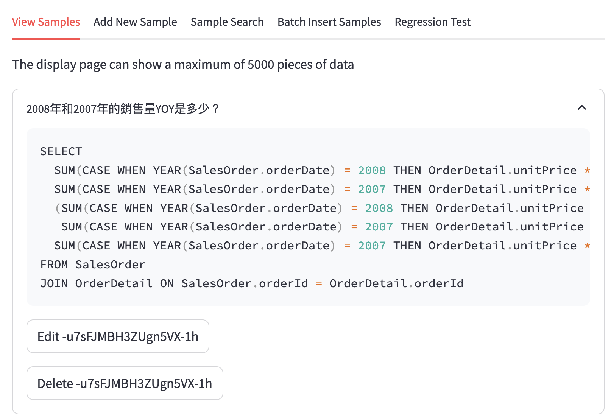
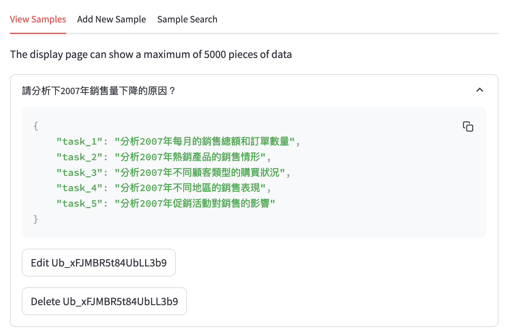
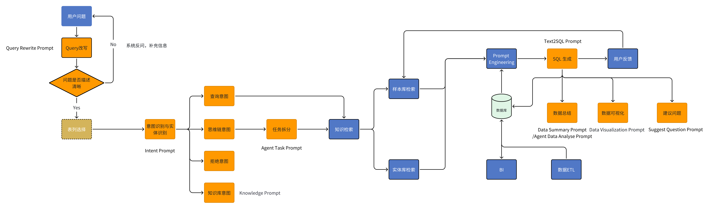

## 1. 添加實體
針對欄位的特殊計算公式, 專有名詞等, 需配置道系統上並後續整合到提示詞中，讓大語言模型理解
以下為相關範例:
+ YOY: YOY是指本期與上期相比較的成長率，計算公式為：YOY =（本期數－上期數）/ 上期數 ×100%
+ 銷售額: 訂單單價*訂單數量，即unitPrice*quantity
+ 東部: 東部，在Region表中的regiondescriptition欄位中，維度值是Eastern
+ Lara: Lara在SalesOrder表中的shipRegion列，具體的維度值是Lara

 

 ## 2. 添加SQL範例
 2008年和2007年的銷售量YOY是多少？
```
SELECT
  SUM(CASE WHEN YEAR(SalesOrder.orderDate) = 2008 THEN OrderDetail.unitPrice * OrderDetail.quantity ELSE 0 END) AS '2008年销售额',
  SUM(CASE WHEN YEAR(SalesOrder.orderDate) = 2007 THEN OrderDetail.unitPrice * OrderDetail.quantity ELSE 0 END) AS '2007年销售额',
  (SUM(CASE WHEN YEAR(SalesOrder.orderDate) = 2008 THEN OrderDetail.unitPrice * OrderDetail.quantity ELSE 0 END) - 
   SUM(CASE WHEN YEAR(SalesOrder.orderDate) = 2007 THEN OrderDetail.unitPrice * OrderDetail.quantity ELSE 0 END)) * 1.0 /
  SUM(CASE WHEN YEAR(SalesOrder.orderDate) = 2007 THEN OrderDetail.unitPrice * OrderDetail.quantity ELSE 0 END) AS 'YOY'
FROM SalesOrder
JOIN OrderDetail ON SalesOrder.orderId = OrderDetail.orderId
 ```
 

 ## 3. 加入歸因分析思路
 ```
請分析下2007年銷售量下降的原因？
{
    "task_1": "分析2007年每月的銷售總額和訂單數量",
    "task_2": "分析2007年熱銷產品的銷售情形",
    "task_3": "分析2007年不同顧客類型的購買狀況",
    "task_4": "分析2007年不同地區的銷售表現",
    "task_5": "分析2007年促銷活動對銷售的影響"
}
 ```


## 4. Prompt修改
+ Query Rewrite:  對使用者的問題根據上下文進行重寫
+ Intent Prompt: 主要進行意圖判斷，目前的意圖主要有四類，知識庫意圖/數據查詢意圖/拒絕查詢意圖/思維鏈意圖
+ Knowledge Prompt:當時識別到知識庫意圖時，回答相關的知識庫問題，目前是透過PE實現，後續查詢可接觸知識庫解決方案
+ Text2SQL Prompt:進行Text2SQL的關鍵Prompt
+ Data Summary Prompt:主要進行資料總結的Prompt，講資料給到LLM產生總結文字
+ Data Visualization Prompt:利用LLM選擇合適的視覺化圖形
+ Agent Task Prompt:利用LLM的理解能力+業務知識，將複雜的業務問題拆分成多個維度的子問題
+ Agent Data Analyse Prompt:針對複雜的業務問題，拆分成多個子任務之後，每個子任務進行資料查詢，查詢完成後，將資料和問題給到LLM進行資料分析
+ Suggest Question Prompt:根據用戶的提問產生建議問題
  


