我們這裡採用的是Northwind資料集，Northwind資料集是一個廣泛使用的樣本資料庫，通常用於教學、練習和展示SQL查詢、資料庫設計和其他資料管理技巧。 ） Traders）的營運數據，主要涉及產品、客戶、訂單、供應商等方面。

主要包含以下表數據
+ Category：類別表，儲存產品類別的詳細信息
+ Region：地區表，儲存地區的詳細信息
+ Territory：銷售區域表，儲存銷售區域的詳細信息，並與區域表關聯
+ CustomerDemographics：儲存客戶類型及其描述
+ Customer：客戶表，儲存客戶的詳細信息
+ CustCustDemographics：客戶人口統計關聯表，建立客戶與客戶人口統計表之間的多對多關聯，一個客戶可能屬於多個人口統計類型
+ Employee：員工表，儲存員工的詳細信息
+ EmployeeTerritory：區域員工關聯表，建立員工與區域表之間的多對多關聯
+ Supplier：供應商表，儲存供應商的詳細信息
+ Product：產品表，儲存產品的詳細信息，並與 Supplier 和 Category 表關聯
+ Shipper：發貨商，倉庫發貨商的詳細信息
+ SalesOrder：訂單表，儲存訂單的詳細信息，並與 Customer, Employee 和 Shipper 表關聯
+ OrderDetail：訂單詳情表，訂單存儲中每個產品的詳細信息，並與 SalesOrder 和 Product 表關聯

資料集的ER圖如下：
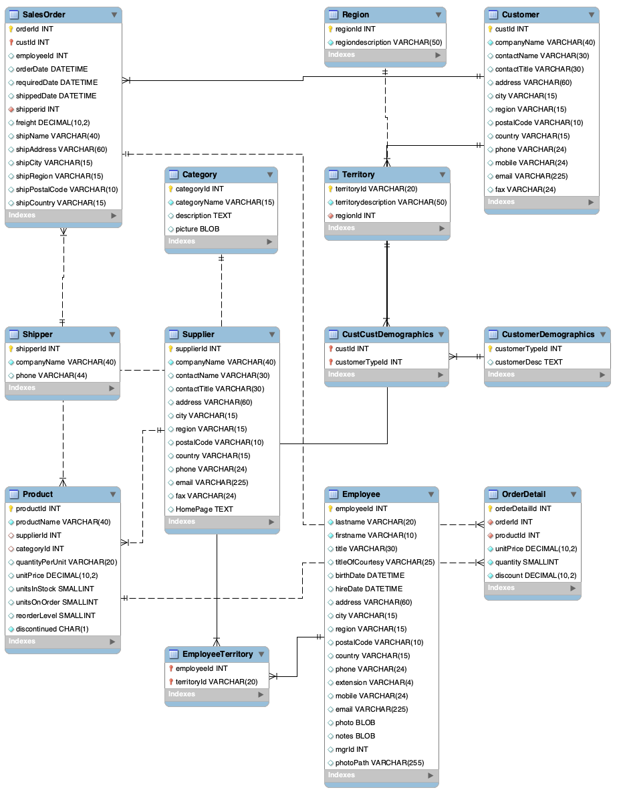

Category資料細節:

CREATE TABLE Category
 (
  categoryId INTEGER COMMENT '類別ID' ,
  categoryName VARCHAR COMMENT '類別名稱' ,
  description TEXT COMMENT '類別描述' ,
  picture BLOB
)

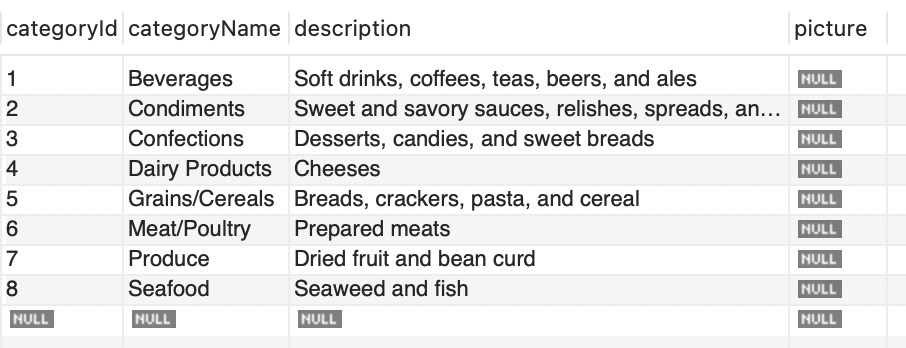

Region資料細節:

CREATE TABLE Region
 (
  regionId INTEGER COMMENT '地區ID',
  regiondescription VARCHAR COMMENT '地區描述'
)

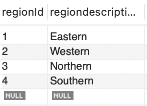

Territory資料細節:

CREATE TABLE Territory
 (
  territoryId VARCHAR COMMENT '銷售區域ID',
  territorydescription VARCHAR COMMENT '銷售區域說明',
  regionId INTEGER COMMENT '所屬地區ID'
)
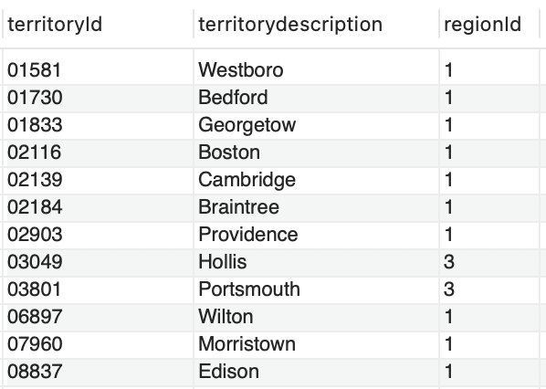

Customer資料細節:

CREATE TABLE Customer
 (
  custId INTEGER COMMENT '客戶ID',
  companyName VARCHAR COMMENT '公司名稱',
  contactName VARCHAR COMMENT '聯絡人姓名',
  contactTitle VARCHAR COMMENT '聯絡人職位',
  address VARCHAR COMMENT '地址',
  city VARCHAR COMMENT '城市',
  region VARCHAR COMMENT '地區',
  postalCode VARCHAR COMMENT '郵遞區號',
  country VARCHAR COMMENT '國',
  phone VARCHAR COMMENT '電話',
  mobile VARCHAR COMMENT '手機號碼',
  email VARCHAR COMMENT '電子郵件',
  fax VARCHAR COMMENT '傳真'
)
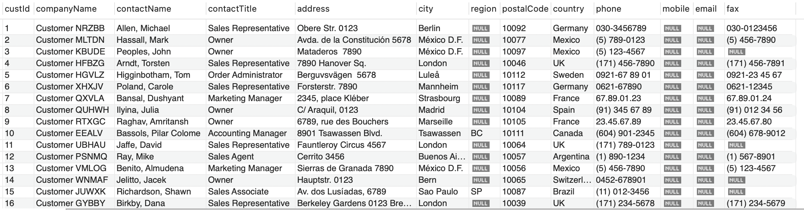

Employee資料細節:
CREATE TABLE Employee
(
  employeeId INTEGER COMMENT '員工ID，外鍵和SalesOrder表中的employeeId關聯',
  lastname VARCHAR ,
  firstname VARCHAR ,
  title VARCHAR COMMENT '職位',
  titleOfCourtesy VARCHAR ,
  birthDate DATETIME COMMENT '出生日期',
  hireDate DATETIME COMMENT '僱用日期',
  address VARCHAR COMMENT '地址',
  city VARCHAR COMMENT '城市',
  region VARCHAR COMMENT '地區',
  postalCode VARCHAR COMMENT '郵遞區號',
  country VARCHAR ,
  phone VARCHAR ,
  extension VARCHAR ,
  mobile VARCHAR ,
  email VARCHAR ,
  photo BLOB ,
  notes BLOB ,
  mgrId INTEGER ,
  photoPath VARCHAR
)

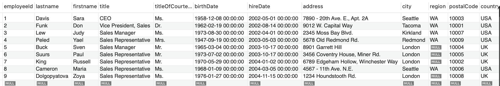

EmployeeTerritory資料細節:

CREATE TABLE EmployeeTerritory
 (
  employeeId INTEGER COMMENT '外鍵，跟Employee表中的employeeId關聯',
  territoryId VARCHAR COMMENT '外鍵，跟Territory表中的territoryId關聯'
)

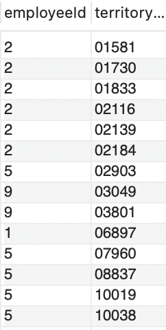

Supplier資料細節

CREATE TABLE Supplier
 (
  supplierId INTEGER COMMENT '供應商ID',
  companyName VARCHAR COMMENT '公司名稱，外鍵跟Shipper中的companyName關聯',
  contactName VARCHAR COMMENT '公司名稱',
  contactTitle VARCHAR COMMENT '公司名稱',
  address VARCHAR ,
  city VARCHAR ,
  region VARCHAR ,
  postalCode VARCHAR ,
  country VARCHAR ,
  phone VARCHAR ,
  email VARCHAR ,
  fax VARCHAR ,
  HomePage TEXT
)

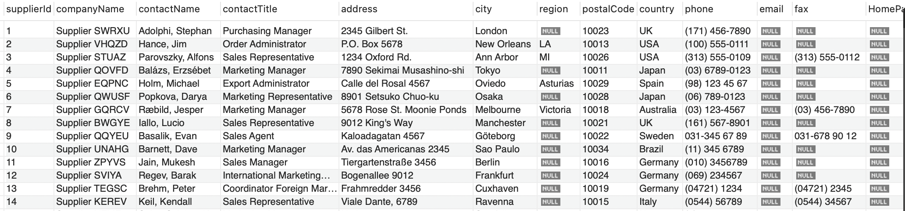

Product資料細節

CREATE TABLE Product
 (
  productId INTEGER COMMENT '產品ID',
  productName VARCHAR COMMENT ' 產品名稱',
  supplierId INTEGER COMMENT '供應商ID，外鍵，跟Supplier中的supplierId關聯',
  categoryId INTEGER COMMENT '外鍵，跟Category中的categoryId關聯',
  quantityPerUnit VARCHAR ,
  unitPrice DECIMAL ,
  unitsInStock SMALLINT ，
  unitsOnOrder SMALLINT ,
  reorderLevel SMALLINT ,
  discontinued CHAR COMMENT '是否停產，1 表示產品已停產，0表示產品未停產'
)

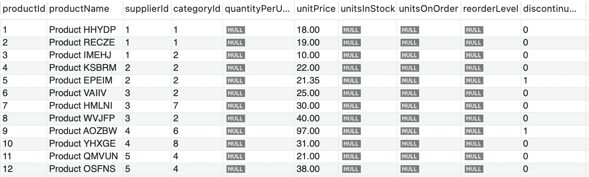

Shipper資料細節

CREATE TABLE Shipper
 (
  shipperId INTEGER COMMENT '運輸公司ID',
  companyName VARCHAR COMMENT '公司名稱',
  phone VARCHAR
)
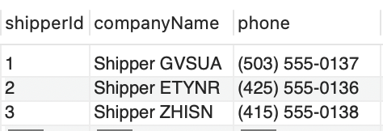

SalesOrder資料細節

CREATE TABLE SalesOrder
 (
  orderId INTEGER COMMENT '訂單編號',
  custId INTEGER COMMENT '客戶編號，外鍵，跟 Customer中的custId關聯',
  employeeId INTEGER COMMENT '員工編號，外鍵，跟 Employee中的custId關聯',
  orderDate DATETIME COMMENT '訂購日期，日期格式yyyy-mm-dd，範例數據，2006-01-01',
  requiredDate DATETIME COMMENT '預計到達日期，日期格式yyyy-mm-dd，範例數據，2006-01-01',
  shippedDate DATETIME COMMENT '出貨日期，日期格式yyyy-mm-dd，範例數據，2006-01-01',
  shipperid INTEGER COMMENT '運貨商，外鍵，跟 Shipper中的shipperid關聯',
  freight DECIMAL COMMENT '運費',
  shipName VARCHAR COMMENT '貨主姓名',
  shipAddress VARCHAR COMMENT '貨主地址',
  shipCity VARCHAR COMMENT '貨主所在城市',
  shipRegion VARCHAR COMMENT '貨主所在地區',
  shipPostalCode VARCHAR COMMENT '貨主郵遞區號',
  shipCountry VARCHAR COMMENT '貨主所在國'
)

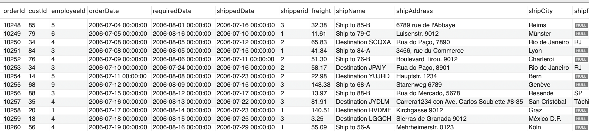

OrderDetail資料細節

CREATE TABLE OrderDetail
 (
  orderDetailId INTEGER COMMENT '訂單詳情ID' ,
  orderId INTEGER COMMENT '訂單ID，外鍵，跟SalesOrder中的orderId關聯',
  productId INTEGER '產品ID，外鍵，跟Product中的productId關聯',
  unitPrice DECIMAL ,
  quantity SMALLINT ,
  discount DECIMAL COMMENT '折扣'
)

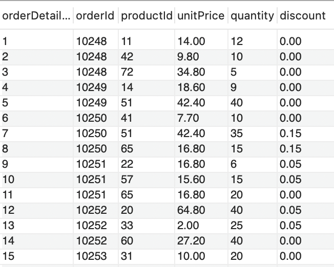

