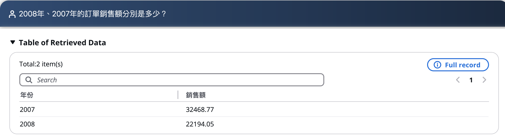
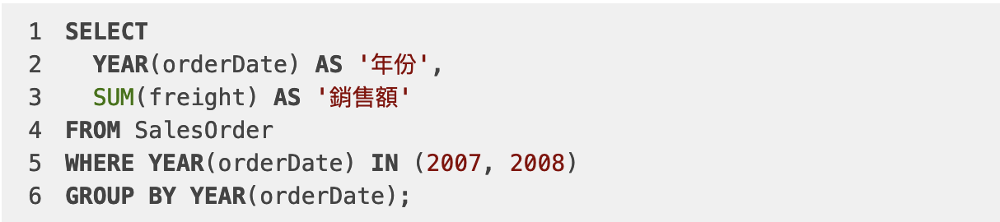
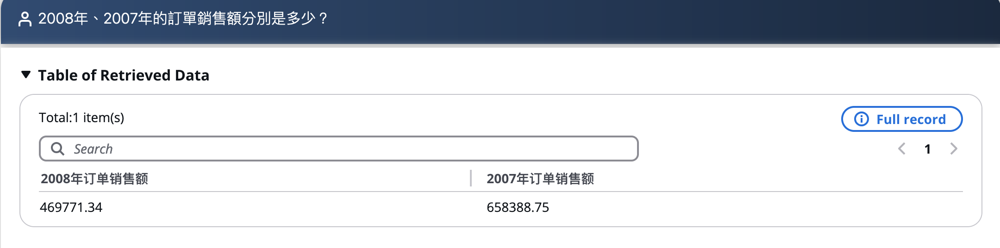
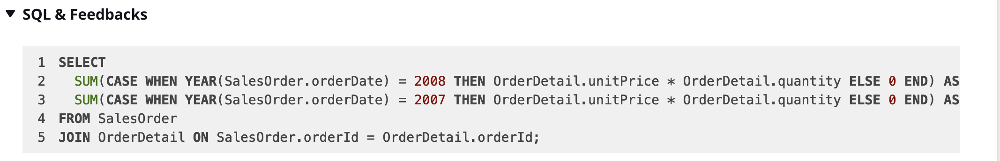
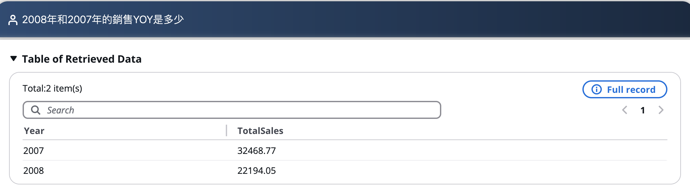
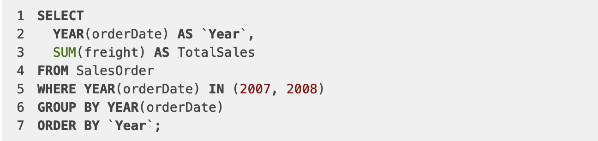
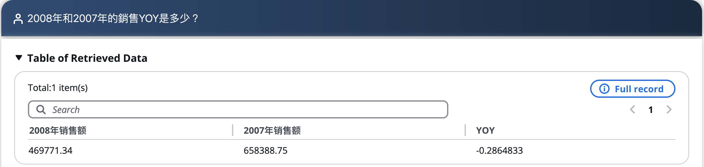
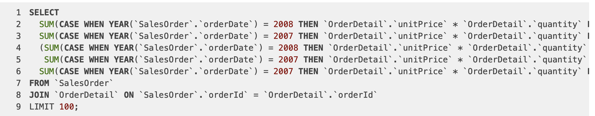
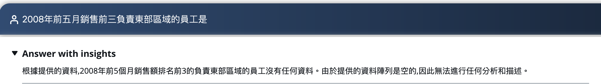
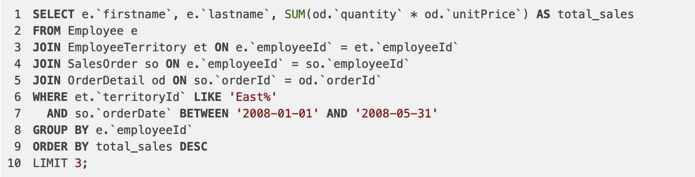

### 1. 基線問題測試調整
| 測試問題 | 問題類型 | 測試結果-修改前 | 測試結果-修改後 | 備註  | 
| -------- | -------- | -------- | -------- | -------- | 
| 找出銷售額最高的前 5 個產品 | 單表查詢 | 正確 | 正確 | 觸發反問，時間選擇2007年1月-10月 | 
| 2008年、2007年的訂單銷售額分別是多少？ | 多表join | 錯誤 | 正確 | 需要新增實體 | 
| 2008年和2007年的銷售YOY是多少？ | 多表join | 錯誤 | 正確 | 需要新增實體 | 
| 2008年前五月銷售前三負責東部區域的員工是？ | 多表join | 錯誤 | 正確 | 新增範例SQL | 
| 2007年1月到10來自Lara的訂單量有多少？ | 單表查詢 | 錯誤 | 正確 | 需要新增實體 | 
|  請列出 供應商 'Supplier GQRCV' 2007年供應的產品數量，產品類型以及銷售額是多少？ | 多表join | 正確 | 正確 |  | 
| 哪個城市的出貨單量最多？ | 單表查詢 | 正確 | 正確 |  | 
| 2008年大於6萬銷售額的員工有哪些？ | 多表查詢 | 正確 | 正確 |  | 
| 相較於2007年，2008年整體運費佔總銷售額的比率為何？ | 多表查詢 | 正確 | 正確 |  | 
| 請分析下為什麼Cunewalde城市的顧客購買能力最強？ | COT問題 |  |  |  | 
| 2008年供貨商的情況和2007年比有什麼變化？ | COT問題 |  |  |  | 
| 請分析下2007年銷售量下降的原因？ | COT問題 |  |  |  | 

1. 2008年、2007年的訂單銷售額分別是多少？

AS-IS:

TO-BE:

2. 2008年和2007年的銷售YOY是多少？

AS-IS:

TO-BE:

3. 2008年前五月銷售前三負責東部區域的員工是？

AS-IS:

