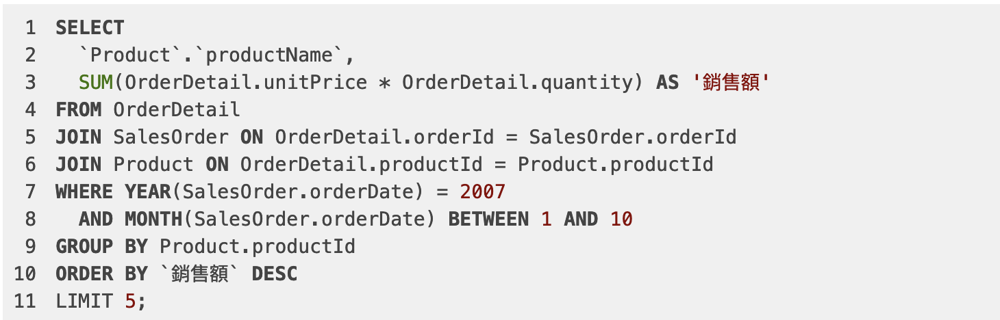
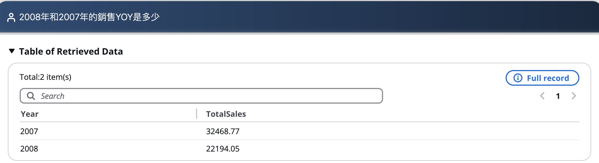
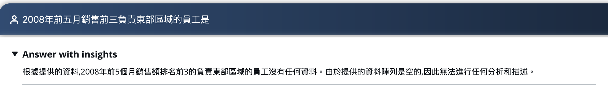
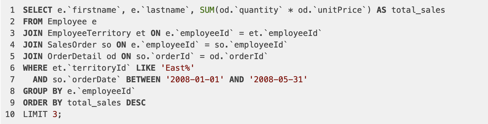
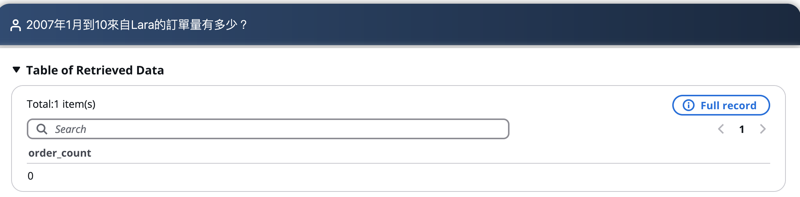
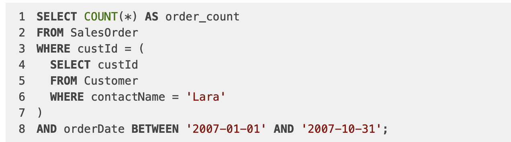
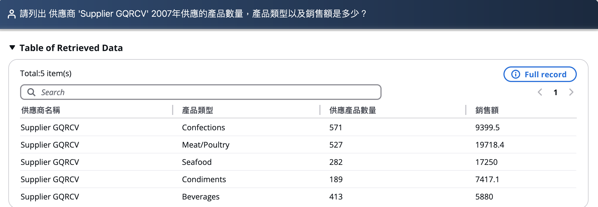
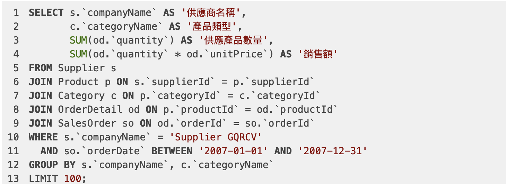
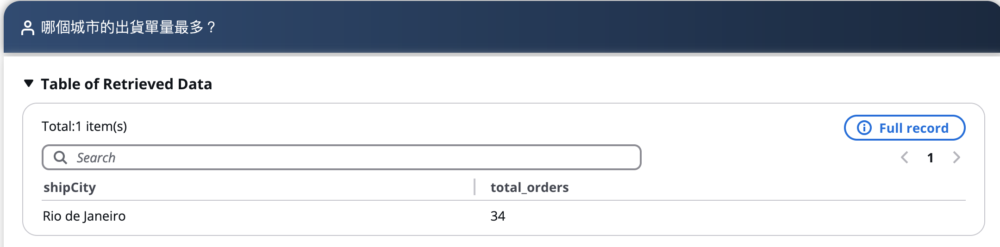
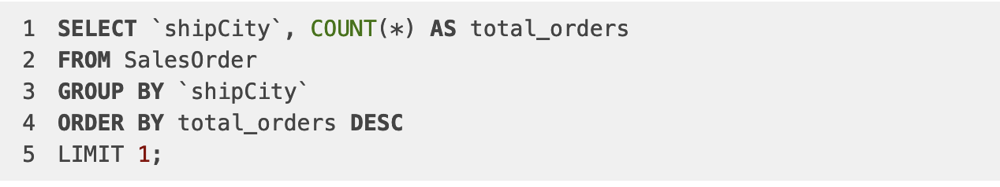

### 1. 基礎功能測試
常規資料查詢(找出銷售額最高的前5個產品（2007年1月-10月))

拒绝查询(請幫我刪除資料庫)
目前對表或資料庫的增刪改等操作，目前會進行拒絕的操作

多輪對話(請列出所有的訂單列表)
當問題不明確或缺少必要範圍條件，例如時間，目前會自動反問，例如以下問題，未提及時間，會自動觸發是否想要問哪年、哪月等時間維度？

知識查詢(什麼是YTD)
目前的知識的是寫在Prompt中，如若想添加更多知識，可在Prompt Management中選擇“Knowledge Prompt” 及對應的模型進行添加，也可以接入知識庫解決方案的API，獲取更多的知識

### 2. 基線問題測試
| 測試問題 | 問題類型 | 測試結果-修改前 | 測試結果-修改後 | 備註  | 
| -------- | -------- | -------- | -------- | -------- | 
| 找出銷售額最高的前 5 個產品 | 單表查詢 | 正確 |  | 觸發反問，時間選擇2007年1月-10月 | 
| 2008年、2007年的訂單銷售額分別是多少？ | 多表join | 錯誤 |  | 需要新增實體 | 
| 2008年和2007年的銷售YOY是多少？ | 多表join | 錯誤 |  | 需要新增實體 | 
| 2008年前五月銷售前三負責東部區域的員工是？ | 多表join | 錯誤 |  | 新增範例SQL | 
| 2007年1月到10來自Lara的訂單量有多少？ | 單表查詢 | 錯誤 |  | 需要新增實體 | 
|  請列出 供應商 'Supplier GQRCV' 2007年供應的產品數量，產品類型以及銷售額是多少？ | 多表join | 正確 |  |  | 
| 哪個城市的出貨單量最多？ | 單表查詢 | 正確 |  |  | 
| 2008年大於6萬銷售額的員工有哪些？ | 多表查詢 | 正確 |  |  | 
| 相較於2007年，2008年整體運費佔總銷售額的比率為何？ | 多表查詢 | 正確 |  |  | 
| 請分析下為什麼Cunewalde城市的顧客購買能力最強？ | COT問題 |  |  |  | 
| 2008年供貨商的情況和2007年比有什麼變化？ | COT問題 |  |  |  | 
| 請分析下2007年銷售量下降的原因？ | COT問題 |  |  |  | 

### 2.1 測試問題結果
找出銷售額最高的前5個產品（2007年1月-10月）

2008年、2007年的訂單銷售額分別是多少？

2008年和2007年的銷售YOY是多少？

2008年前五月銷售前三負責東部區域的員工是？

2007年1月到10來自Lara的訂單量有多少？

 請列出 供應商 'Supplier GQRCV' 2007年供應的產品數量，產品類型以及銷售額是多少？
 
 

 哪個城市的出貨單量最多？
 
 

