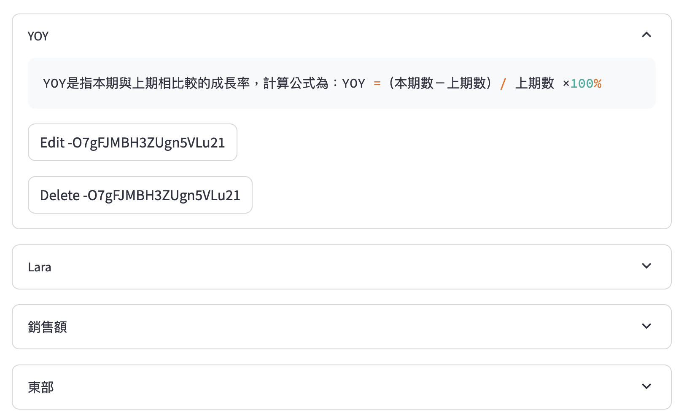

## 1. 添加實體
針對欄位的特殊計算公式, 專有名詞等, 需配置道系統上並後續整合到提示詞中，讓大語言模型理解
以下為相關範例:
+ YOY: YOY是指本期與上期相比較的成長率，計算公式為：YOY =（本期數－上期數）/ 上期數 ×100%
+ 銷售額: 訂單單價*訂單數量，即unitPrice*quantity
+ 東部: 東部，在Region表中的regiondescriptition欄位中，維度值是Eastern
+ Lara: Lara在SalesOrder表中的shipRegion列，具體的維度值是Lara

 

 ## 2. 添加SQL範例
 2008年和2007年的銷售量YOY是多少？
<code>
SELECT
  SUM(CASE WHEN YEAR(SalesOrder.orderDate) = 2008 THEN OrderDetail.unitPrice * OrderDetail.quantity ELSE 0 END) AS '2008年销售额',
  SUM(CASE WHEN YEAR(SalesOrder.orderDate) = 2007 THEN OrderDetail.unitPrice * OrderDetail.quantity ELSE 0 END) AS '2007年销售额',
  (SUM(CASE WHEN YEAR(SalesOrder.orderDate) = 2008 THEN OrderDetail.unitPrice * OrderDetail.quantity ELSE 0 END) - 
   SUM(CASE WHEN YEAR(SalesOrder.orderDate) = 2007 THEN OrderDetail.unitPrice * OrderDetail.quantity ELSE 0 END)) * 1.0 /
  SUM(CASE WHEN YEAR(SalesOrder.orderDate) = 2007 THEN OrderDetail.unitPrice * OrderDetail.quantity ELSE 0 END) AS 'YOY'
FROM SalesOrder
JOIN OrderDetail ON SalesOrder.orderId = OrderDetail.orderId
 </code>

